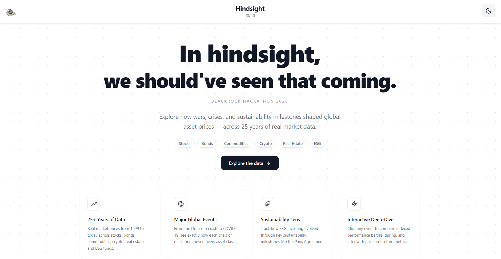
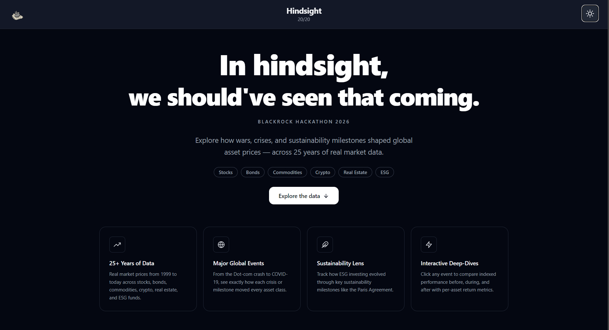
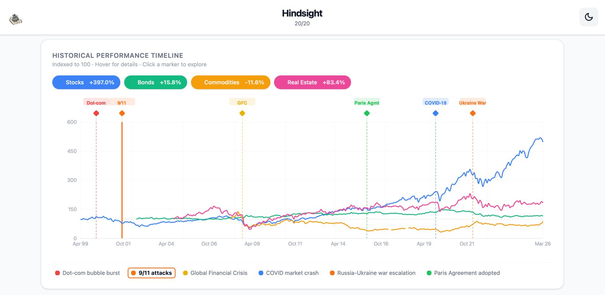
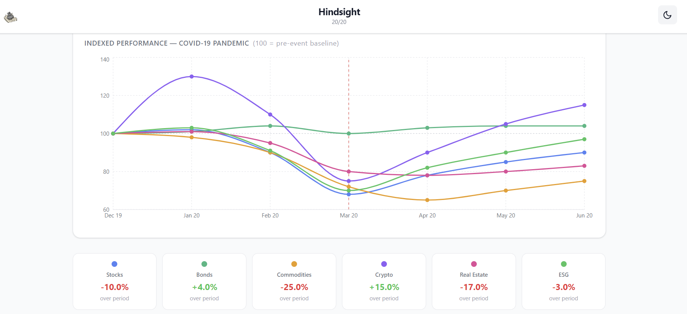
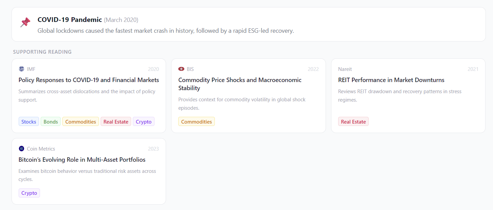

# Hindsight
From History to Market Insight.

This is Team Hindsight's project for the BlackRock x WICS x FinTech hackathon on 14/03/2026, where the theme was to "introduce and educate students to the world of personal finance".

## Project Overview

Hindsight 20/20 is an interactive financial education dashboard that visualise how different asset classes—such as stocks, bonds, commodities, and cryptocurrencies—react to major global events. Users can explore a timeline of significant news, including wars, financial crises, terrorist attacks, and interest rate changes, and see how markets responded from 1999 to today. 

By selecting specific events, students can visualise and compare the performance of different asset classes, helping them understand how real-world events influence financial markets, investor behavior, and risk across the global economy.

### Key Features
- **Live normalised index** — all asset classes indexed to 100 at the first event baseline, fetched from Twelve Data
- **Event deep-dives** — 3-month before/after impact chart with reference line at event date
- **Per-asset stat cards** — % change over the event window
- **Supporting articles** — curated reading per event fetched from /api/articles
- **Sustainability lens** — highlights ESG-relevant events with dedicated callout
- **Dark mode** — full light/dark theme toggle

## Tech Stack
| Layer       | Technology                            |
| ----------- | ------------------------------------- |
| Frontend    | React + Vite, Tailwind CSS, Recharts  |
| Backend     | Node.js + Express                     |
| Market data | Twelve Data API (monthly time series) |
| AI analysis | Google Gemini API                     |

## The website

### Home page
#### Light mode

#### Dark mode


### Overall timeline


### Individual timeline


### Reading articles


## Running Locally

### Back-end
```bash
cd back-end
cp .env.example .env        # add TWELVE_DATA_API_KEY and GEMINI_API_KEY
npm install
node server.js
```

### Front-end
```bash
cd front-end
cp .env.example .env        # set VITE_API_BASE_URL=http://127.0.0.1:25355
npm install
npm run dev
```

## Team members

Tamra Chan, Hayden Kua, Yi Xin Chong, and Hanaa Khan.

